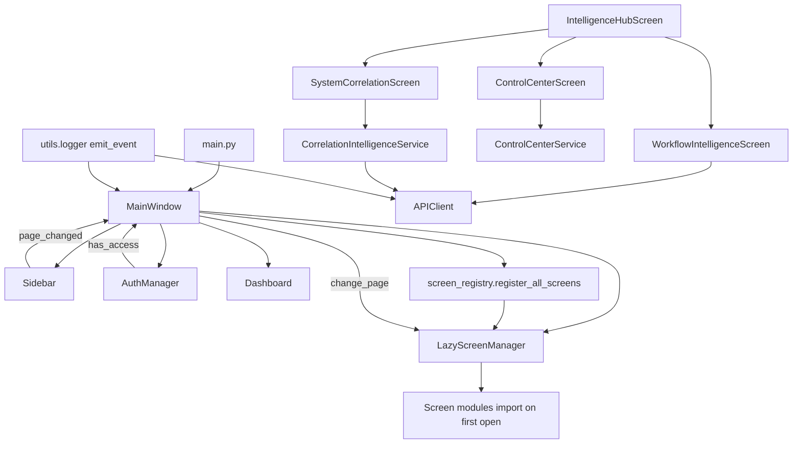

# Performance Sprint V1 — Impact Analysis (Phase 0)

**Date:** 2026-05-30  
**Scope:** Stabilization only — no architecture redesign, no feature removal.

## Dependency map

## Components touched vs isolated

| Component | Sprint change | Login | Permissions | Navigation | Telemetry |
|-----------|---------------|-------|-------------|------------|-----------|
| MainWindow | Lazy registry + deferred timers | Unchanged | `change_page` + `has_access` unchanged | Same indices | `emit_event` kept |
| LazyScreenManager | No API change | — | — | Same `load(index)` | — |
| Workflow Intelligence | QThread fetch | — | — | Tab lazy load | — |
| Correlation | QThread + parallel HTTP | — | — | Tab lazy load | — |
| APIClient | Fail-fast + `background` | Auth/refresh unchanged | 403 handling unchanged | — | `record_api_time` kept |
| screen_registry | New file | — | Uses same `auth_manager` inject | Same index map | — |
| Dashboard | Defer refresh 3.5s | — | — | — | — |

## Event bus (backend)

- `EnterpriseEventBus`: **13 types, 13 log-only handlers** — not modified.
- Frontend: `emit_event` / `record_screen_load` — not modified.

## Screen lifecycle

| Hook | Behavior after sprint |
|------|----------------------|
| `_on_screen_shown` | Workflow/Correlation start async load (non-blocking) |
| `_on_screen_hidden` | Cancel worker threads (`requestInterruption` + `wait(300)`) |
| Hub tab switch | Generation counter drops stale callbacks |

## Risk register (pre-mitigation)

| Risk | Mitigation |
|------|------------|
| Stale thread updates destroyed widget | `_load_generation` guard on all slots |
| Orphan QThread | Cancel on hide + on new load |
| Missing screen index | Registry copied 1:1 from pre-sprint `main_window` |
| Double status bar | `_setup_status_bar` unchanged (single call) |

## Screen import matrix (summary)

| Phase | Module imports at MainWindow build |
|-------|-----------------------------------|
| **Before** | ~45 screen modules + report_browser + finance/hr/system |
| **After** | `ui.screen_registry` + `ui.dashboard` + shell widgets only |

Full index list: `frontend/ui/screen_registry.py` (`register_all_screens`).

## Approval

Safe to proceed: changes are localized to loading strategy and HTTP retry policy; no business logic or schema changes.
